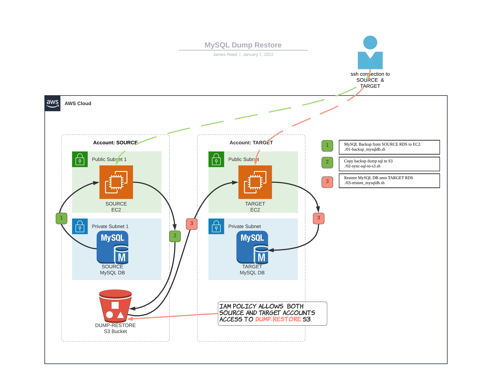

CDC 6600 (ca 1964), A supercomputer in its day.  RAM: 128K Words of core memory - less than 1MB. 


> The illustration above has nothing to do with this Git Repository.  I place it here so that we can marvel at how far we have come since the early days of computer science.  The CDC 6600, designed by Seymour Cray, had a cycle time of 100ns (10 MHz).  It is safe to say that my Apple Watch has a faster, more capable CPU.


---

# MySQL Dump Restore


Solution overview.

This repository consists of _bash_ scripts and _Terraform_ configurations to implement infrastructure in **two** AWS accounts.  The purpose of which is to **mysqldump** an RDS instance in one account (SOURCE) and restore the resulting dumped databases in another account (TARGET) with a similar RDS instance.

## The  Process  

---
### Preparation

1. Preparations:
 - Make sure you have Key-Pairs for both the SOURCE and TARGET accounts.
 - Familiarize yourself with the VPC security gateways and route tables for your environments.
 - The Terraform configurations should help speed up the process.  Hopefully!


2. Clone this repository into your local workspace.

```
$ git clone git@github.com:reed54/MySQL_Dump_Restore.git
Cloning into 'MySQL_Dump_Restore'...
remote: Enumerating objects: 90, done.
remote: Counting objects: 100% (90/90), done.
remote: Compressing objects: 100% (61/61), done.
remote: Total 90 (delta 27), reused 85 (delta 26), pack-reused 0
Receiving objects: 100% (90/90), 2.72 MiB | 6.59 MiB/s, done.
Resolving deltas: 100% (27/27), done.
```

3. Collect parameters related to your AWS accounts.  Details about the SOURCE and TARGET accounts.  You will need the host strings of your RDS databases as well as root username and password.  Edit the appropriate **variables.tf** files.

#### Source EC2 (Terraform/ec2/source_ec2/variables.tf)  

|  Variable         |     Description                                                |
|-------------------|----------------------------------------------------------------|
| region            | AWS region designation.  e.g., us-east-2                       |
| profile           | Profile within local ~/.aws/credentials file.                  | 
| amz-ubuntu-ami    | AMI for both SOURCE and TARGET EC2s. Ubuntu 20.04 LTS.         |
| source_key_name   | Source EC2 key-pair.  The KP must exist before Terraform apply.|
| source_account    | Account number for SOURCE Account.  Both account numbers are required. |
| target_account    | Account number for TARGET Account.                             |
| vpc_id            | VPC ID where SOURCE RDS instance is located.                   |
| ec2_subnet_id     | Public Subnet within the VPC for the SOURCe ec2.               |
|                   |                                                                |

#### Target EC2 (Terraform/ec2/target_ec2/variables.tf)  


|  Variable         |     Description                                                |
|-------------------|----------------------------------------------------------------|
| region            | TARGET AWS region designation.  e.g., us-east-2                |
| profile           | TARGET Profile within local ~/.aws/credentials file.           |
| amz-ubuntu-ami    | AMI for both SOURCE and TARGET EC2s. Ubuntu 20.04 LTS          |
| target_key_name   | Target EC2 key-pair.  The KP must exist before Terraform apply.|
| target_account    | Account number for TARGET Account.                             |
| vpc_id            | VPC ID where TARGET RDS instance is located.                   |
| ec2_subnet_id     | Public Subnet within the VPC for the TARGET ec2.               |
|                   |                                                                |

If the user wishes to setup a complete test environments with two EC2 virtual machines AND small RDS instances, Terraform configurations are included in _Terraform/rds_.  These must be setup **before** the EC2 instances.

---
### Creating the EC2s and Setting up Access to the Respective RDS Instances.


4. Apply the information gathered in step #2 to the appropriate _variables.tf_ files.  Note, it is important to run the TARGET Terraform configuration **after** the SOURCE configuration.q

5. Deploy (terraform apply) the SOURCE EC2, S3 and the TARGET EC2.  Following is a compressed output of the _terraform apply_ process.

```
$ cd MySQL_Dump_Restore/Terraform/ec2/source_ec2
$ terraform apply

aws_iam_role.S3AdminRole: Creating...
aws_s3_bucket.dump-restore: Creating...
aws_security_group.Matrix-SG: Creating...
aws_iam_role.S3AdminRole: Creation complete after 2s [id=S3AdminRole]
aws_iam_role_policy.S3Policy: Creating...
aws_iam_instance_profile.ec2_profile: Creating...
aws_iam_role_policy.S3Policy: Creation complete after 0s [id=S3AdminRole:S3Policy]
aws_iam_instance_profile.ec2_profile: Creation complete after 1s [id=ec2_profile]
aws_security_group.Matrix-SG: Creation complete after 3s [id=sg-012eeef7aef905ed6]
aws_instance.ec2-source: Creating...
aws_s3_bucket.dump-restore: Creation complete after 4s [id=dump-restore20220107000213270300000001]
data.aws_iam_policy_document.allow_access_from_another_account: Reading...
local_file.bucket_id: Creating...
data.aws_iam_policy_document.allow_access_from_another_account: Read complete after 0s [id=4153769628]
local_file.bucket_id: Creation complete after 0s [id=b911ad5c5f9a55fbca0435754b3b3827e0df1c2f]
aws_s3_bucket_policy.allow_access_from_another_account: Creating...
aws_s3_bucket_policy.allow_access_from_another_account: Creation complete after 0s [id=dump-restore20220107000213270300000001]
aws_instance.ec2-source: Still creating... [10s elapsed]
aws_instance.ec2-source: Still creating... [20s elapsed]
aws_instance.ec2-source: Provisioning with 'file'...
aws_instance.ec2-source: Still creating... [30s elapsed]
aws_instance.ec2-source: Still creating... [40s elapsed]
aws_instance.ec2-source: Still creating... [50s elapsed]
aws_instance.ec2-source: Still creating... [1m0s elapsed]
aws_instance.ec2-source: Still creating... [1m10s elapsed]
aws_instance.ec2-source: Provisioning with 'file'...
aws_instance.ec2-source: Provisioning with 'file'...
aws_instance.ec2-source: Provisioning with 'remote-exec'...
aws_instance.ec2-source (remote-exec): Connecting to remote host via SSH...
aws_instance.ec2-source (remote-exec):   Host: 35.87.147.23
aws_instance.ec2-source (remote-exec):   User: ubuntu
aws_instance.ec2-source (remote-exec):   Password: false
aws_instance.ec2-source (remote-exec):   Private key: true
aws_instance.ec2-source (remote-exec):   Certificate: false
aws_instance.ec2-source (remote-exec):   SSH Agent: false
aws_instance.ec2-source (remote-exec):   Checking Host Key: false
aws_instance.ec2-source (remote-exec):   Target Platform: unix
aws_instance.ec2-source (remote-exec): Connected!
aws_instance.ec2-source: Creation complete after 1m20s [id=i-0f455db8e36365fb8]

Apply complete! Resources: 8 added, 0 changed, 0 destroyed.

Outputs:

bucket-arn = "arn:aws:s3:::dump-restore20220107000213270300000001"
ec2-source_IP = "35.87.147.23"
ec2-source_private_dns = "ip-172-26-0-99.us-west-2.compute.internal"
ec2-source_public_dns = "ec2-35-87-147-23.us-west-2.compute.amazonaws.com"
(base) jdreed@Nikola:~/TERRAFORM/EM/MySQL_Dump_Restore/Terraform/ec2/source_ec2$ 
```

6. Deploy the TARGET EC2 in a similar manner.

```
$ cd MySQL_Dump_Restore/Terraform/ec2/target_ec2
$ terraform apply

Changes to Outputs:
  + ec2-target_IP          = (known after apply)
  + ec2-target_private_dns = (known after apply)
  + ec2-target_public_dns  = (known after apply)
aws_iam_role.S3AdminRole: Creating...
aws_security_group.Matrix-SG: Creating...
aws_iam_role.S3AdminRole: Creation complete after 2s [id=S3AdminRole]
aws_iam_role_policy.S3Policy: Creating...
aws_iam_instance_profile.ec2_profile: Creating...
aws_iam_role_policy.S3Policy: Creation complete after 1s [id=S3AdminRole:S3Policy]
aws_security_group.Matrix-SG: Creation complete after 2s [id=sg-07330c70d2e352159]
aws_iam_instance_profile.ec2_profile: Creation complete after 1s [id=ec2_profile]
aws_instance.ec2-target: Creating...
aws_instance.ec2-target: Still creating... [10s elapsed]
aws_instance.ec2-target: Still creating... [20s elapsed]
aws_instance.ec2-target: Provisioning with 'file'...
aws_instance.ec2-target: Still creating... [30s elapsed]
aws_instance.ec2-target: Still creating... [40s elapsed]
aws_instance.ec2-target: Still creating... [50s elapsed]
aws_instance.ec2-target: Provisioning with 'file'...
aws_instance.ec2-target: Provisioning with 'file'...
aws_instance.ec2-target: Provisioning with 'remote-exec'...
aws_instance.ec2-target (remote-exec): Connecting to remote host via SSH...
aws_instance.ec2-target (remote-exec):   Host: 35.86.175.246
aws_instance.ec2-target (remote-exec):   User: ubuntu
aws_instance.ec2-target (remote-exec):   Password: false
aws_instance.ec2-target (remote-exec):   Private key: true
aws_instance.ec2-target (remote-exec):   Certificate: false
aws_instance.ec2-target (remote-exec):   SSH Agent: false
aws_instance.ec2-target (remote-exec):   Checking Host Key: false
aws_instance.ec2-target (remote-exec):   Target Platform: unix
aws_instance.ec2-target (remote-exec): Connected!
aws_instance.ec2-target: Creation complete after 57s [id=i-0fdc4387d32e8ef31]

Apply complete! Resources: 5 added, 0 changed, 0 destroyed.

Outputs:

ec2-target_IP = "35.86.175.246"
ec2-target_private_dns = "ip-172-26-0-183.us-west-2.compute.internal"
ec2-target_public_dns = "ec2-35-86-175-246.us-west-2.compute.amazonaws.com"

```

7. Login to the SOURCE EC2 and edit the _~/.my.cnf_ with the values required to access the MySQL RDS instance.

---
### Backup the SOURCE RDS from the SOURCE EC2.

8. On the SOURCE EC2, execute the backup script **01-backup_mysqldb.sh**.

9. Deploy (terraform apply) the TARGET EC2.
```
$ cd MySQL_Dump_Restore/Terraform/ec2/target_ec2
$ terraform plan
$ terraform apply
```

10. Login to the TARGET EC2 and setup the _~/.my.cnf_ according to the prototype to gain access to the TARGET RDS instance.  After this you should be able to access the RDS by simply typing:  

```
Linux ip-172-26-0-15 5.11.0-1022-aws #23~20.04.1-Ubuntu SMP Mon Nov 15 14:03:19 UTC 2021 x86_64 x86_64 x86_64 GNU/Linux
ubuntu@ip-172-26-0-15:~$ source ~/.profile
 #####
#     #   ####   #    #  #####    ####   ######
#        #    #  #    #  #    #  #    #  #
 #####   #    #  #    #  #    #  #       #####
      #  #    #  #    #  #####   #       #
#     #  #    #  #    #  #   #   #    #  #
 #####    ####    ####   #    #   ####   ######

ubuntu@ip-172-26-0-15:~$ mysql

Welcome to the MariaDB monitor.  Commands end with ; or \g.
Your MySQL connection id is 22  
Server version: 5.7.12 MySQL Community Server (GPL)  

Copyright (c) 2000, 2018, Oracle, MariaDB Corporation Ab and others.  

Type 'help;' or '\h' for help. Type '\c' to clear the current input statement.  

MySQL [(none)]` show databases;`  
+--------------------+  
| Database           |    
+--------------------+    
| information_schema |    
| employees          |    
| mysql              |    
| performance_schema |    
| sys                |    
+--------------------+    
5 rows in set (0.00 sec)    

MySQL [(none)]>
```
11.  Still logged into the SOURCE EC2, execute the **02-sync-sql-to-s3.sh** script.
```
$ cd dump-restore
$ ./02-sync-sql-to-s3.sh
[2022-01-01 23:25:53+00:00]: ****************************************
[2022-01-01 23:25:53+00:00]: Begin 02-sync-sql-to-s3.sh
[2022-01-01 23:25:53+00:00]: ----------------------------------------
[2022-01-01 23:25:53+00:00]: Synching /tmp/rds-2022-01-01/ to s3://matrix-dump-restore/rds/rds-2022-01-01/ ...
[2022-01-01 23:25:53+00:00]: ----------------------------------------
[2022-01-01 23:25:54+00:00]:
[2022-01-01 23:25:54+00:00]:
[2022-01-01 23:25:55+00:00]: 2022-01-01 21:31:45 172404810 rds/rds-2022-01-01/dump.sql
[2022-01-01 23:25:55+00:00]: End   02-sync-sql-to-s3.sh
[2022-01-01 23:25:55+00:00]: ****************************************
[2022-01-01 23:25:55+00:00]:
```

12. Login to the TARGET EC2 and execute the **03-restore_mysqldb.sh**
```
Last login: Thu Jan  6 22:25:32 2022 from 64.98.52.202
To run a command as administrator (user "root"), use "sudo <command>".
See "man sudo_root" for details.

#######
   #       ##    #####    ####   ######   #####
   #      #  #   #    #  #    #  #          #
   #     #    #  #    #  #       #####      #
   #     ######  #####   #  ###  #          #
   #     #    #  #   #   #    #  #          #
   #     #    #  #    #   ####   ######     #

ubuntu@ip-172-26-0-235:~$ cd dump-restore
ubuntu@ip-172-26-0-235:~/dump-restore$ ./03-restore_mysqldb.sh
[2022-01-06 23:42:56+00:00]: ****************************************
[2022-01-06 23:42:56+00:00]: Begin restore-mysqldb.sh
[2022-01-06 23:42:56+00:00]: ----------------------------------------
[2022-01-06 23:42:56+00:00]: Restoring DBs from s3://dump-restore20220106042450199300000001//tmp/rds//rds-2022-01-06/dump.sql ...
[2022-01-06 23:42:56+00:00]: -------------
[2022-01-06 23:42:57+00:00]: /tmp/rds//rds-2022-01-06/dump.sql exists. No need to download it from S3.
[2022-01-06 23:42:57+00:00]: Restoring DB START from /tmp/rds//rds-2022-01-06/dump.sql
[2022-01-06 23:44:46+00:00]: restore-mysqldb.sh /tmp/rds//rds-2022-01-06/dump.sql  COMPLETE.
[2022-01-06 23:44:46+00:00]: Databases restoration complete.
[2022-01-06 23:44:46+00:00]: Complete execution restore-mysqldb.sh
[2022-01-06 23:44:46+00:00]: ****************************************
[2022-01-06 23:44:46+00:00]:

ubuntu@ip-172-26-0-183:~$ mysql
Welcome to the MySQL monitor.  Commands end with ; or \g.
Your MySQL connection id is 80
Server version: 5.7.12 MySQL Community Server (GPL)

Copyright (c) 2000, 2021, Oracle and/or its affiliates.

Oracle is a registered trademark of Oracle Corporation and/or its
affiliates. Other names may be trademarks of their respective
owners.

Type 'help;' or '\h' for help. Type '\c' to clear the current input statement.

mysql> show databases;
+--------------------+
| Database           |
+--------------------+
| information_schema |
| employees          |
| employees2         |
| mysql              |
| performance_schema |
| sys                |
+--------------------+
6 rows in set (0.00 sec)

mysql>

```


                     
## Your Feedback is Appreciated.

As is often said, hardware eventually breaks and software eventually works.  Let me know your experiences with this work in progress.

Jim Reed/Centennial Data Science  
jdreed1954@hotmail.com
